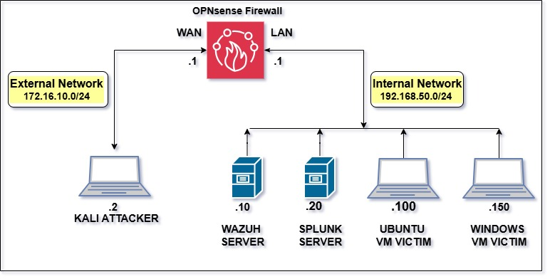
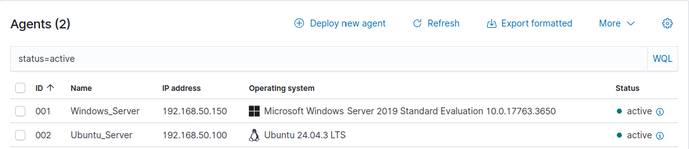
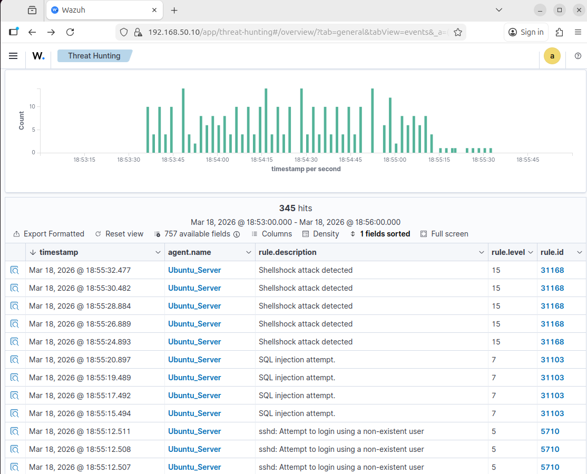
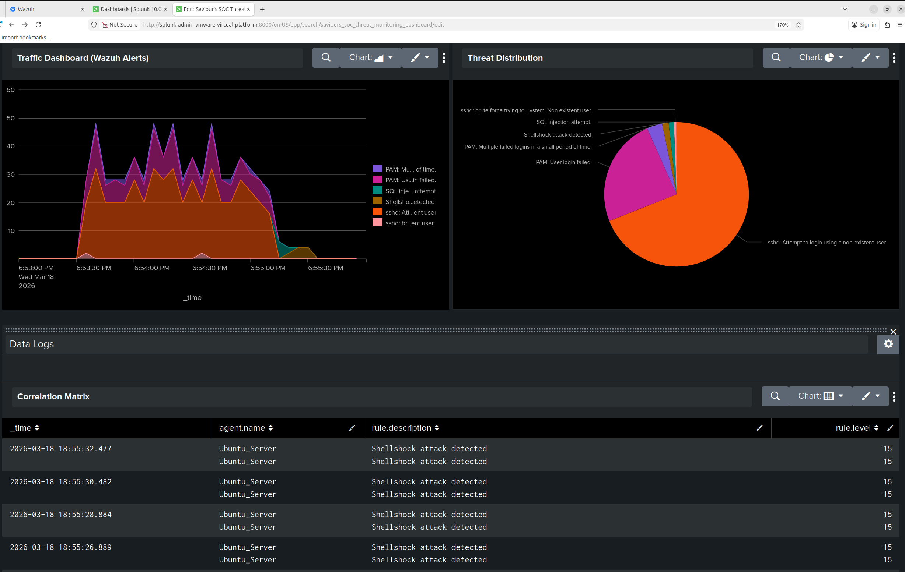

# Enterprise SIEM Pipeline & Threat Hunting Lab

## 🎯 Objective
This project demonstrates the end-to-end engineering of a Security Information and Event Management (SIEM) pipeline. The objective was to build a segmented, secure network architecture, simulate active cyber attacks, and successfully capture, forward, and visualize the resulting threat intelligence.

## 🏗️ Architecture & Technologies Used
* **Network Segmentation:** OPNsense Firewall separating an external untrusted zone from an internal server zone.
* **Host Intrusion Detection (HIDS):** Wazuh 
* **Log Aggregation & Analytics:** Splunk Enterprise (Universal Forwarder pipeline on TCP 9997)
* **Adversary Emulation:** Kali Linux (Hydra, custom payload execution)

*Figure 1: Logical network topology demonstrating a segmented Zero Trust environment.*

## ⚙️ SIEM Infrastructure Setup
To ensure comprehensive visibility, Wazuh agents were deployed across multiple operating systems in the internal network to monitor local event logs and system integrity.

*Figure 2: Verified active Wazuh agents monitoring internal Windows Server 2019 and Ubuntu hosts.*

## ⚔️ Red Team Execution (Adversary Emulation)
To generate realistic threat data, attacks were executed against the internal Ubuntu server from an external Kali Linux machine:
1. **SSH Brute-Force:** Sustained dictionary attacks generating high volumes of failed authentication logs.
2. **Web Application Exploitation:** Execution of **Shellshock (CVE-2014-6271)** and **SQL Injection** payloads via manipulated HTTP requests to trigger high-severity alerting rules.

## 🛡️ Detection & Threat Hunting (Blue Team)
The attacks were successfully detected by the Wazuh manager, which parsed the local agent logs and triggered the appropriate rule levels (e.g., Rule Level 15 for Shellshock). 

*Figure 3: Wazuh dashboard successfully catching and categorizing the live web exploits.*

These alerts were then forwarded in real-time to **Splunk Enterprise**. Custom dashboards were engineered to visualize the attack traffic, categorize the threat distribution, and provide a clear, timestamped correlation matrix for SOC analysts.

*Figure 4: Custom Splunk dashboard providing real-time threat visualization and color-coded log correlation.*

## 📄 Full Project Documentation
For a deep dive into the network configurations, firewall rules, and critical reflections, please review the full technical report included in this repository:
[View Full Technical Report (PDF)](Enterprise-SIEM-Technical-Report.pdf)
